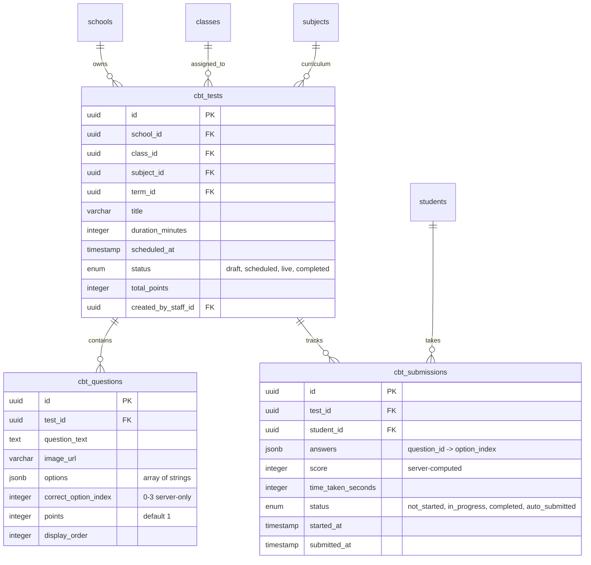

# ScholeOS — Engineering Handbook & Developer Notes

> **Platform:** ScholeOS — Modern Operating System & Management Platform for Schools  
> **Status:** 🏆 ALL WAVES (Wave 1 through Wave 9) COMPLETE · Platform Full-Stack Ready  
> **Last Updated:** September 2026  
> **Lead Architect:** Senior Frontend Engineer

---

## 1. Project Roadmap & Wave Tracker

ScholeOS is constructed in sequential, self-contained **Waves**. Each wave establishes a stable, production-grade layer before the next is layered on top.

| Wave | Milestone | Scope / Deliverables | Status |
| :--- | :--- | :--- | :--- |
| **Wave 1** | **Foundation & Design System** | Token architecture, Tailwind config, core UI components (Button, Card, Input, IconBadge, Badge, Navbar, Footer), interactive Style Guide | 🟢 **COMPLETED** |
| **Wave 2** | **Public Landing Page** | High-converting marketing homepage, hero, features, testimonials, pricing, mobile nav, stats bar, FAQ accordion, demo booking modal | 🟢 **COMPLETED** |
| **Wave 3** | **Auth & School Onboarding** | Login screen, multi-step school setup wizard, Stepper component, dynamic grading formula builder, logo & branding live preview | 🟢 **COMPLETED** |
| **Wave 4** | **Admin Dashboard Shell** | Master layout, sidebar, quick stats, school metrics, user directory, announcements | 🟢 **COMPLETED** |
| **Wave 5** | **Subject Teacher Dashboard** | Gradebook, score entry grid, continuous assessment (CA), bulk uploads, audit trails | 🟢 **COMPLETED** |
| **Wave 6** | **Class Teacher Dashboard** | Daily attendance tracker, submission monitor, broadsheet generation, term report cards | 🟢 **COMPLETED** |
| **Wave 7** | **Parent & Student Views** | Child switcher, progress tracking, fee payments & receipts, shared attendance & results, homework submissions, weekly timetable | 🟢 **COMPLETED** |
| **Wave 8** | **Fees & Payments UI** | Institutional fee structures, class scoping, arrears tracking, sort/filter, reminders, bank transfer proof reconciliation | 🟢 **COMPLETED** |
| **Wave 9** | **AI Assistant Panels** | ChatWindow component, Admin Copilot (chat & report card comments), Student AI Tutor (subject context & study guidance) | 🟢 **COMPLETED** |
| **Wave 10** | **CBT (Computer-Based Test) Module** | Timer, QuestionNavigator, SelectableCard primitives; Teacher Test List, Question Builder, Results; Student CBT Portal, Full-screen Exam Room, Graded Script Review | 🟢 **COMPLETED** |
| **Wave 11** | **Admin Announcements & Broadcasts** | Broadcast list page, full-page composer with audience scoping (Everyone, Parents, Students, Staff, Specific Class), multi-channel dispatches (In-App, SMS, WhatsApp), scheduled delivery, live card preview, and safety confirmation modal | 🟢 **COMPLETED** |
| **Wave 12** | **Admin Settings & Configuration** | Institutional metadata editing, live branding preview & logo upload, repeatable classes & curriculum subjects with student deletion safety modal, 100% continuous assessment weight builder, and subscription plan upgrade with billing history | 🟢 **COMPLETED** |

### Backend Wave Tracker

| Backend Wave | Module / Layer | Scope / Key Deliverables | Status |
| :--- | :--- | :--- | :--- |
| **Wave 1** | **Database Schema (Postgres) + Clerk Auth** | 16 Drizzle tables, tenant isolation via `school_id`, Clerk Org multi-role auth, migrations & demo seed | 🟢 **COMPLETED** |
| **Wave 2** | **Firestore Real-Time Layer + Security Rules** | 4 collections, `scholesos` Firebase project, strict zero-client-write rules, `schoolId` claim read gate, App Check enforcement, Firebase Admin & client read helpers | 🟢 **COMPLETED** |
| **Wave 3** | **`identity-service`** | Clerk webhooks, admin staff provisioning & deactivation, Firebase custom token bridge with `{ schoolId, role }`, `/assignments/me` | 🟢 **COMPLETED** |
| **Wave 4** | **`academic-service`** | Score submission, continuous assessment computation, report card/broadsheet generation | 🟢 **COMPLETED** |
| **Wave 5** | **`fees-service`** | Invoices, payment webhooks, bank transfer verification queue | 🟢 **COMPLETED** |
| **Wave 6** | **`notification-service`** | SMS & WhatsApp dispatch via Cloudflare Queues | 🟢 **COMPLETED** |
| **Wave 7** | **`document-service`** | PDF report card generation, landscape broadsheets, payment receipts, student ID cards with SVG QR codes, Cloudinary asset storage, immutable document caching | 🟢 **COMPLETED** |
| **Wave 8** | **`licensing-service`** | Shared zero-network-hop license middleware, fail-safe write blocking, 7-day grace period, daily cron transitions, and Platform Super Admin endpoints | 🟢 **COMPLETED** |
| **Wave 9** | **`ai-service`** | Admin report card comments & Student Socratic tutor endpoints | ⏳ *Next Wave* |
| **Wave 10** | **CBT Backend** | Question banks, timed examination sessions, auto-grading | ⚪ *Queued* |

---

## 2. Design System Tokens & Foundations

Every UI screen in ScholeOS strictly follows these design tokens.

### Color Palette
- **Base Background:** `#FBF0E1` (Warm Cream) — Soft, approachable, reduces eye strain compared to harsh whites.
- **Surface / Cards:** `#FFFFFF` (Pure White) — Elevated card surfaces on top of the cream background.
- **Primary Brand Accent:** `#4338CA` (Indigo) — Primary buttons, active navigation states, prominent headings, focus rings.
- **Secondary Brand Accent:** `#D4A017` (Warm Gold) — Icon badges, star highlights, featured indicators, decorative accents.
- **Dark Surface:** `#1E1B1A` (Charcoal) — Footer, stats bar, high-contrast dark sections.
- **Text Primary:** `#1E1B1A` (Near Black) for high contrast and readability.
- **Text Muted:** `#6B7280` (Cool Gray) for secondary labels, helper descriptions, and placeholders.
- **Status Accents:**
  - Success: `#059669` (Emerald Green)
  - Warning: `#D97706` (Amber)
  - Danger: `#DC2626` (Crimson Red)
  - Neutral: `#64748B` (Slate Gray)

### Typography
- **Headings (`font-display`):** Google Fonts **Poppins** (`600`, `700`, `800`, `900`) — Bold, rounded, friendly yet authoritative sans-serif with tight line-height.
- **Body Text (`font-sans`):** Google Fonts **Inter** (`400`, `500`, `600`, `700`) — Highly legible, neutral workhorse sans-serif.

---

## 3. Component Library API & Architecture (`frontend/src/components/`)

### Core UI Library (`ui/`)
- **`Button`**: Fully pill-shaped (`rounded-full`), primary (solid indigo), secondary (outline indigo), icon button, and ghost variants.
- **`Card`**: Elevated white surface container with `rounded-2xl` corners, soft drop shadow (`schole-card-shadow`), and compound composition.
- **`Input`**: Clean white background, thin border, icon prefix support, focus ring (`#4338CA`), and validation error state.
- **`IconBadge`**: Small square container (`rounded-xl`) with solid warm gold fill (`#D4A017`) and centered white line icons.
- **`Badge`**: Status label pills (`success`, `warning`, `danger`, `neutral`, `primary`, `gold`) with animated pulse dot option.
- **`Accordion`**: Compound accordion primitives (`Accordion`, `AccordionItem`, `AccordionTrigger`, `AccordionContent`) with smooth chevron rotation and height transitions.
- **`Stepper` (New in Wave 3)**:
  - Horizontal progress indicator showing numbered / labeled steps.
  - Highlights current step in primary indigo `#4338CA`.
  - Completed steps render crisp checkmark icons.
  - Mobile responsive: collapses to "Step X of 5" with a clean progress bar.
- **`Navbar`**: Responsive header with logo + gold badge, navigation links (*About, Features, Pricing, FAQ*), "Log In" secondary button, "Book a Demo" primary button, and mobile hamburger drawer.
- **`Footer`**: Dark charcoal (`#1E1B1A`) footer with 4 columns (*About, Features, Support, Legal*) and exact copyright notice.

---

## 4. Wave 3 Implementation: Authentication & School Onboarding Wizard

### Part A — Login Page (`pages/LoginPage.tsx`)
- Centered white `Card` (`max-w-[420px]`) on warm cream background.
- Heading *"Welcome back"* and subtext *"Log in to manage your school on ScholeOS."*.
- Email input with envelope icon prefix and format validation.
- Password input with lock icon prefix and visibility reveal toggle (`Eye` / `EyeOff`).
- Right-aligned *"Forgot password?"* link.
- Full-width primary pill button *"Continue"*.
- Register prompt linking directly to the onboarding wizard.
- Field-level validation displaying red borders and descriptive helper error messages.

### Part B — School Setup Wizard (`pages/OnboardingWizardPage.tsx`)
Multi-step flow powered by the `Stepper` component across 5 steps:
1. **Step 1: School Details**
   - Official School Name (text input)
   - School Short Name / Abbreviation (text input for SMS/documents)
   - Physical Address (text input)
   - Number of Students (approximate select: Under 200, 200-500, 500-1000, 1000+)
2. **Step 2: Branding**
   - School Logo Upload dropzone with live preview
   - Preset accent color swatches (Royal Indigo, Forest Emerald, Deep Navy, Crimson Maroon, Warm Gold, Regal Purple) + custom hex input
   - Live Branding Preview panel showing a mock mini dashboard header with the logo and chosen accent color
3. **Step 3: Classes & Subjects**
   - Repeatable list builder for classes with text input and delete icon button
   - Repeatable list builder for subjects with text input and delete icon button
   - *"Load a starter template"* pre-fills standard Nigerian secondary school structure (JSS 1-3, SSS 1-3 WAEC, core sciences and humanities)
4. **Step 4: Dynamic Scoring System**
   - Headings: *"Set up how your school calculates results"* and subtext explaining 100% weight requirement
   - Repeatable assessment components with name and percentage inputs (pre-filled with editable defaults: Exam 60%, Welcome Back Test 20%, Final Test 20%)
   - Live running total calculator: displays green when total equals exactly 100%, red/amber otherwise
   - Continue button enforced/disabled until weights equal exactly 100%
5. **Step 5: Review & Finish**
   - Read-only summary card of all configuration metrics
   - Final submit action *"Create My School"* triggering celebratory confirmation state

---

## 5. Verification Log

- **[2026-09-06]**: Built `Stepper` component in `components/ui/Stepper/` with responsive mobile collapse.
- **[2026-09-06]**: Built `LoginPage.tsx` with email/password validation and error states.
- **[2026-09-06]**: Built `OnboardingWizardPage.tsx` with 5-step wizard, Nigerian starter templates, live branding preview, and dynamic scoring formula validation.
- **[2026-09-06]**: Updated `App.tsx` with a floating multi-wave switcher for seamless review between Landing, Login, Onboarding Wizard, and Design Tokens.
- **[2026-09-06]**: Ran `tsc -b && vite build` — compilation passed cleanly with **0 errors** in `30.08s`.
- **[2026-09-06]**: Hot Module Replacement updated dev server at `http://127.0.0.1:5173/`.
- **[2026-09-06]**: **Wave 3 is complete and verified! Ready for Wave 4 (Admin Dashboard Shell).**
- **[2026-09-06]**: Git repository initialized, `.gitignore` configured to exclude `node_modules` & `dist`, branch configured to `main`, remote origin linked to `https://github.com/odulanaprogress/ScholeOS.git`, and successfully pushed to GitHub.

---

## 5. Wave 4 — Admin Dashboard Shell, Overview & Staff Management

### Part A — Persistent Dashboard Shell (`components/layout/DashboardLayout.tsx`)
1. **Sidebar (`components/ui/Sidebar/Sidebar.tsx`)**
   - Fixed left navigation bar, collapsible to icon-only mode with desktop toggle.
   - Mobile responsive drawer sliding out on smaller screens (`< 768px`) with dimmed backdrop.
   - School branding banner displaying school logo/initials and active accent color highlight.
   - Navigation links: Overview, Students, Staff, Classes & Subjects, Results & Broadsheets, Fees, Attendance, Announcements, AI Assistant, Settings.
   - "Trial: 12 days left" pill badge near bottom for plan status.
2. **TopBar (`components/ui/TopBar/TopBar.tsx`)**
   - Fixed top header spanning the width next to the sidebar.
   - Mobile hamburger menu trigger.
   - Global search input for instant discovery.
   - Notification bell with unread badge and popover showing real-time event log and "Mark all read".
   - Admin profile avatar + name ("Alhaji Dr. S. Bello", "Principal / Administrator") with interactive dropdown (Profile, Settings, Log Out).
3. **Mobile Bottom Navigation Bar**
   - Direct thumb-accessible quick links on mobile devices: Overview, Staff, Results, Fees, and "More" drawer trigger.

### Part B — Overview Page (`pages/admin/OverviewPage.tsx`)
- **Row of StatCards (`components/ui/StatCard/StatCard.tsx`)**:
  - Total Students: 1,280 (+14 this term enrolled)
  - Fee Arrears: ₦3,420,000 (warning tone, 42 students outstanding, opens breakdown modal)
  - Classes Fully Submitted: 6 / 10 (dynamic ratio tone, 60% with progress bar)
  - Active Staff: 48 (46 on duty today, links to staff roster)
- **Class Score Submission Status Card**:
  - Roster of 8 secondary classes with teacher in charge, progress bar, and status badges (`Complete`, `In Progress`, `Not Started`).
- **Quick Actions Card**:
  - Direct shortcuts to Add Staff, View Arrears Breakdown modal, and Send Announcement broadcast modal.
- **Recent School Activity Card**:
  - Chronological audit stream of teacher score submissions, fee payments, and attendance marks.

### Part C — Staff Management Page (`pages/admin/StaffManagementPage.tsx`)
- **Table (`components/ui/Table/Table.tsx`)**:
  - High-density data table displaying Staff Member (initials avatar, name, email), Role badge (`Class Teacher` in gold, `Subject Teacher` in primary indigo), Assigned Classes and Subjects, Status badge (`Active` green, `Suspended` gray), and action controls.
- **Search & Filter Controls**:
  - Keyword search by name, email, subject, or class.
  - Role dropdown filter (All, Class Teacher, Subject Teacher).
  - Status dropdown filter (All, Active, Suspended).
- **Add Staff Modal (`components/ui/Modal/Modal.tsx`)**:
  - Accessible dialog with Full Name, Email, Role selector.
  - Form master single class ownership selector for Class Teachers.
  - Repeatable subject & class assignment rows with "+ Add another assignment" and remove buttons.
  - "Send Invite" action dynamically adds new educator to the state table with feedback toast.
- **Deactivate Confirmation Modal**:
  - Destructive confirmation flow: *"Deactivate [Name]? They will lose access immediately. Their past submitted records will be kept."*
  - Reversibly switches teacher status to `Suspended` with option to reactivate.

---

## 6. Verification Log

- **[2026-09-06]**: Built `Sidebar`, `TopBar`, `Table`, `Modal`, and `StatCard` reusable UI primitives in `components/ui/`.
- **[2026-09-06]**: Built persistent `DashboardLayout` shell supporting responsive desktop collapse and mobile drawer + bottom nav.
- **[2026-09-06]**: Built `OverviewPage.tsx` with StatCards, submission status progress, quick actions, and recent activity feed.
- **[2026-09-06]**: Built `StaffManagementPage.tsx` with filterable staff table, Add Staff modal with repeatable assignments, and Deactivate confirmation modal.
- **[2026-09-06]**: Updated `App.tsx` with wave switcher and connected login/onboarding transitions into the admin dashboard.
- **[2026-09-06]**: Executed `npm run build` (`tsc -b && vite build`) — passed with **0 errors** in `8.72s` (1889 modules transformed).
- **[2026-09-06]**: Hot Module Replacement verified in running Vite dev server at `http://127.0.0.1:5173/`.
- **[2026-09-06]**: **Wave 4 is complete and verified! Ready for Wave 5 (Subject Teacher Dashboard - Score Entry).**

---

## 6. Wave 5 — Subject Teacher Dashboard (Score Entry)

### Part A — Reusable Components & Adaptable Shell
1. **Tabs (`components/ui/Tabs/Tabs.tsx`)**
   - Clean horizontal tab bar with underline and pill variants.
   - Highlights the active class in the school's accent color (`#4338CA`).
   - Supports status badges (`Draft`, `Submitted`, `Locked`) and smooth mobile horizontal scroll.
2. **Role-Tailored Dashboard Shell (`components/layout/DashboardLayout.tsx`)**
   - Nav items: Overview, Score Entry, Assignments, Announcements.
   - Excludes license trial pill and admin-only settings.
   - Dynamic user identity: `Mrs. Bola Adeyemi` (`Mathematics & Physics Faculty`).
   - Mobile quick navigation bar adapted for teacher workflows (Overview, Scores, Tasks, More).

### Part B — Teacher Overview Page (`pages/teacher/TeacherOverviewPage.tsx`)
- **Metric StatCards:**
  - My Classes: 3 allocated arms (JSS 2A, JSS 2B, SSS 1 Science).
  - Pending Submissions: 1 (amber warning tone; action required banner for JSS 2A Mathematics).
  - Students Taught: 114 total enrolled secondary students.
- **My Teaching Assignments Table:**
  - Displays Class, Subject, Student Count, Status badge, and direct "Go to Score Entry" action button linking into the active class tab.

### Part C — Score Entry Page (`pages/teacher/ScoreEntryPage.tsx`)
- **Top Tabs Bar:** Instant switching between assigned classes with live status chips.
- **Dynamic Assessment Scheme Columns:**
  - Renders columns dynamically from school settings: `Exam (60)`, `Welcome Back Test (20)`, `Final CA Test (20)`.
  - Max values labeled in headers; enforces validation (`0 <= score <= maxWeight`) with instant red border alerts.
- **Sticky Student Name Column:** Keeps Student Name & ID fixed on the left while horizontal scrolling across score components on mobile screens.
- **Live Auto-Calculating Total & WAEC Grade:**
  - Sums test marks and exam marks in real-time.
  - Generates official WAEC grade previews (A1, B2, C4, D7, E8, F9).
- **Status Workflows & Modals:**
  - `Draft` status: editable number inputs, "Save Draft" button, and "Submit for Review" button with confirmation modal warning of locking.
  - `Submitted` / `Locked` status: read-only text values and "Request to Reopen" button with reason justification dialog for the Principal.

### Part D — Coursework & Assignments Page (`pages/teacher/TeacherAssignmentsPage.tsx`)
- **Coursework Table:** Title & resource filename, Class, Subject, Due Date, and submission progress bar.
- **Add Assignment Modal:** Title, Description, Class+Subject select, Due Date, and drag-and-drop file upload dropzone for worksheets and lab guides.

---

## 8. Wave 6 — Class Teacher Dashboard Architecture & Implementation

Wave 6 equips Form Masters / Class Teachers with complete terminal management over their designated class arm (`JSS 2A`, 38 students):

### New Reusable Design System Primitives (`components/ui/`)
1. **`DatePicker` (`components/ui/DatePicker/DatePicker.tsx`)**:
   - Styled native date input matching the exact token height, rounded borders, and focus rings of `Input`.
   - Includes calendar icon prefix and presets for today's date.
2. **`Textarea` (`components/ui/Textarea/Textarea.tsx`)**:
   - Multi-line textarea matching `Input` design tokens, supporting custom row counts, error states, and responsive resizing.

### Part A — Class Teacher Overview (`pages/class-teacher/ClassTeacherOverviewPage.tsx`)
- **Metric StatCards:**
  - `My Class`: Class arm identifier (`JSS 2A`).
  - `Today's Attendance`: Live status badge (`Marked` in emerald or `Not Marked` in amber) with student ratio.
  - `Subjects Submitted`: Ratio counter (`5 / 8` or `8 / 8`) with dynamic percentage progress.
  - `Students in Class`: Total enrolled student count (38).
- **Submission Status Breakdown Card:**
  - Progress bar showing submitted subject percentage.
  - List of all 8 curriculum subjects with status badges (`Draft`, `Submitted`, `Locked`) and submission timestamps.

### Part B — Daily Attendance Register (`pages/class-teacher/AttendancePage.tsx`)
- **Header & Controls:** DatePicker defaulting to current date with calendar shortcut, "Mark All Present" one-click action, and "Save Attendance" button.
- **Interactive Student Roll:**
  - Full class roster with Admission Number, Full Name, and 3-option toggle pill group (`Present`, `Absent`, `Late`).
  - Color-coded active states: Present (Emerald), Late (Amber), Absent (Rose).
- **Save Confirmation:**
  - Persists attendance and renders an animated green confirmation banner with timestamp and count breakdown.

### Part C — Subject Score Submission Tracker (`pages/class-teacher/SubmissionTrackerPage.tsx`)
- **Curriculum Roster Table:**
  - Tracks all 8 subjects (Mathematics, English Language, Basic Science, Social Studies, Agricultural Science, Business Studies, Civic Education, French Language).
  - Shows assigned Teacher Name, Status Badge, and Last Updated timestamp.
- **Teacher Reminder Workflow:**
  - For `Draft` subjects, renders a "Send Reminder" button.
  - On click, triggers SMS/portal alert notification, updates button state to "Reminded" with checkmark, and disables repeat dispatch.
- **Progress Summary Banner:**
  - Visual completion bar and direct call-to-action to proceed to Broadsheet once submissions are complete.

### Part D — Master Broadsheet & Report Cards (`pages/class-teacher/BroadsheetPage.tsx`)
- **Submission Guard Banner:**
  - Incomplete state: Warning banner alert indicating pending subjects and blocking final publication. Includes reviewer shortcut "Simulate All 8 Submitted".
  - Ready state: Success banner enabling "Publish & Lock Class".
  - Locked state: Indigo banner confirming permanent terminal lock.
- **Master Broadsheet Table:**
  - Sticky Student Name column fixed on the left for seamless mobile horizontal scrolling.
  - 8 Subject Columns showing total scores out of 100 with color-coded distinction thresholds (scores >= 75 in emerald, < 50 in rose).
  - Grand Total column (/800), Class Average percentage, and Position ranking with ordinal labels (`1st`, `2nd`, `3rd`, etc.) and highlighted Top 3 badges.
- **Individual Report Card Modal:**
  - Biodata and terminal summary banner (Admission No, Position, Grand Total, Term Average).
  - Full curriculum assessment breakdown table with CA Total (40), Exam Score (60), Total (100), WAEC Grade, and Remarks.
  - Form Master's Qualitative Comment powered by `Textarea`, quick phrase suggestions, and instant save action.
- **Publish & Lock Class Confirmation Modal:**
  - Enforces permanent terminal sealing for the term, generating official parent portal report cards and locking scores.

---

## 9. Verification Log

- **[2026-09-06]**: Built reusable `Tabs` component in `components/ui/Tabs/`.
- **[2026-09-06]**: Enhanced `Sidebar` and `DashboardLayout` with role-based navigation and identity support.
- **[2026-09-06]**: Built `TeacherOverviewPage.tsx` with StatCards, deadline alert banner, and class assignments table.
- **[2026-09-06]**: Built `ScoreEntryPage.tsx` with dynamic assessment columns, max-weight validation, live Total calculator, WAEC grade badges, sticky column mobile table, and submit/reopen modals.
- **[2026-09-06]**: Built `TeacherAssignmentsPage.tsx` with coursework table and Add Assignment modal with file upload dropzone.
- **[2026-09-06]**: Built reusable `DatePicker` and `Textarea` primitives in `components/ui/`.
- **[2026-09-06]**: Built `ClassTeacherOverviewPage.tsx`, `AttendancePage.tsx`, `SubmissionTrackerPage.tsx`, and `BroadsheetPage.tsx`.
- **[2026-09-06]**: Connected Class Teacher views into `App.tsx` with role navigation items and interactive quick-switch buttons in the review dock.
- **[2026-09-06]**: Executed `npm run build` (`tsc -b && vite build`) — passed with **0 errors** in `18.22s` (1903 modules transformed).
- **[2026-09-06]**: Interactive browser subagent test executed at `http://127.0.0.1:5173/` verifying Overview, Attendance, Tracker, Broadsheet, Report Card modal, and Publish & Lock flows.
- **[2026-09-06]**: Captured screenshots and recorded browser session (`class_teacher_check_-62135596800000.webp`).
- **[2026-09-06]**: **Wave 6 is complete and verified! Ready for Wave 7 (Parent & Student Views).**

---

## 10. Wave 7 — Parent & Student Dashboards Architecture & Implementation

Wave 7 introduces specialized portals for **Parents** and **Students**, built on top of the established `DashboardLayout` shell from Wave 4, while reusing existing UI primitives without style drift.

### Architectural Highlights & Component Reuse
- **Shared Components**: The Student portal directly reuses `ParentResultsPage` and `ParentAttendancePage` by setting `showChildSwitcher={false}` and passing the active student identity.
- **Child Switcher (`pages/parent/ChildSwitcher.tsx`)**: Responsive pill selector mounted above parent pages allowing instantaneous switching between multiple enrolled wards (`Fatima Bello — JSS 2A`, `Farouk Bello — Primary 4B`), updating attendance, results, and fee balances synchronously.
- **Wave 9 AI Placeholders (`pages/AiComingSoonPage.tsx`)**: Elegant placeholder page for "AI Assistant" (Parent) and "AI Tutor" (Student) linking cleanly ahead of Wave 9.

### Part A — Parent Dashboard (`pages/parent/`)
1. **Parent Overview (`ParentOverviewPage.tsx`)**:
   - Child switcher bar with avatar pills.
   - **StatCards**:
     - *Attendance This Term* (e.g. `94%`, Emerald tone, 42 Present · 3 Absent · 1 Late).
     - *Fee Balance* (e.g. `₦45,000`, Amber warning tone if outstanding, `₦0` Emerald when cleared).
     - *Latest Result* (e.g. `84.2% · 3rd in Class`, WAEC distinction indicator).
   - Quick action shortcuts (Pay Fees, View Report Card, Full Attendance).
   - School Announcements feed with priority badges (`Important`, `Event`, `General`).
2. **Attendance History (`ParentAttendancePage.tsx`)**:
   - Term summary status bar showing present/absent/late counts.
   - Detailed date-by-date register table with filter by status (`All`, `Present`, `Absent`, `Late`).
3. **Term Results & Broadsheet Archive (`ParentResultsPage.tsx`)**:
   - Term-by-term card grid showing session, term, position, and publication status (`Published` green badge vs. `Pending` gray).
   - **Interactive Report Card Modal (`size="xl"`)**:
     - Official school header with student bio, admission number, and class rank.
     - 8-subject WAEC breakdown table (CA Total /40, Exam /60, Total /100, WAEC Grade, Teacher Remark).
     - Form Master qualitative comment and Principal sign-off stamp.
     - "Download Report Card (PDF)" simulation action.
4. **Fees & Payments Portal (`ParentFeesPage.tsx`)**:
   - Overview StatCards: Total Outstanding, Amount Paid This Term, Next Due Date.
   - Invoice itemization table with status badges (`Paid`, `Pending`, `Overdue`, `Pending Verification`).
   - **"Pay Now" Modal**:
     - Tabs for **Debit Card Payment** (instant simulation with card number, expiry, CVV) and **Direct Bank Transfer** (shows official school Wema/Zenith bank account details, reference code).
     - Bank Transfer Proof Dropzone: Drag-and-drop receipt image upload (`.jpg`, `.png`, `.pdf`) with instant preview.
     - Submitting proof immediately transitions the target invoice to `Pending Verification` with amber badge and updates outstanding balances.

### Part B — Student Dashboard (`pages/student/`)
1. **Student Overview (`StudentOverviewPage.tsx`)**:
   - Personalized welcome header (`Fatima Bello — JSS 2A · Arts & Sciences`).
   - StatCards: Term Attendance (`94%`), Pending Assignments (`2 Due This Week`), Latest Average (`84.2%`).
   - Today's Class Schedule ticker.
   - Upcoming Coursework alert card with direct "Start Submission" actions.
2. **Student Assignments & Coursework (`StudentAssignmentsPage.tsx`)**:
   - Filterable assignments table (Subject, Title, Due Date, Max Marks, Status badge).
   - Status filters: `All`, `Pending`, `Submitted`, `Graded`.
   - **Assignment Submission Modal**:
     - Assignment instructions, due date, and attached teacher reference worksheet download.
     - Student solution upload dropzone with file picker and text notes input.
     - "Submit Assignment" action that updates coursework status to `Submitted` with green badge and submission timestamp.
3. **Student Weekly Timetable (`StudentTimetablePage.tsx`)**:
   - Monday through Friday 8-period weekly schedule matrix.
   - Period-by-period color-coded blocks for core subjects, assemblies, and breaks.
   - Current day / current period dynamic highlight indicator.
   - "Download Timetable (PDF)" export action.

---

## 11. Verification Log

- **[2026-09-06]**: Created Parent data models and mock state in `pages/parent/parentData.ts`.
- **[2026-09-06]**: Built `ChildSwitcher.tsx` with responsive multi-child avatar toggle.
- **[2026-09-06]**: Built `ParentOverviewPage.tsx`, `ParentAttendancePage.tsx`, `ParentResultsPage.tsx`, and `ParentFeesPage.tsx`.
- **[2026-09-06]**: Built Student data models and coursework in `pages/student/studentData.ts`.
- **[2026-09-06]**: Built `StudentOverviewPage.tsx`, `StudentAssignmentsPage.tsx` with submission modal, and `StudentTimetablePage.tsx`.
- **[2026-09-06]**: Built Wave 9 placeholder component `AiComingSoonPage.tsx` for AI Assistant and AI Tutor.
- **[2026-09-06]**: Integrated all routes and nav items into `App.tsx` with floating reviewer buttons (`Parent`, `Fees`, `Student`, `Tasks`, `Schedule`).
- **[2026-09-06]**: Executed production build: `npm run build` (`tsc -b && vite build`) — **0 errors**, built cleanly in `23.87s` (1,916 modules transformed).
- **[2026-09-06]**: Ran end-to-end browser verification subagents:
  - Parent Portal session recorded: `parent_student_check_1788695762284.webp`
  - Report Card modal captured: `report_card_modal_1788695973808.png`
  - Fees bank transfer verification captured: `fees_cleared_1788696242557.png`
  - Student Portal session recorded: `student_portal_check_1788696297899.webp`
  - AI Tutor placeholder captured: `student_dashboard_ai_tutor_1788696959925.png`
- **[2026-09-06]**: **Wave 7 is complete and verified! Ready for Wave 8 (Fees & Payments UI).**

---

## 12. Wave 8 — Admin Fees & Payments UI Architecture & Implementation

Wave 8 establishes the complete institutional **Fees & Payments Management** suite for school administrators, living under the `"fees"` sidebar navigation item inside `DashboardLayout`. It implements three interconnected sub-views managed via a top `Tabs` control:

### Part A — Fee Structure Tab (`pages/admin/fees/FeeStructureTab.tsx`)
- **Configured Fees Roster Table**:
  - Columns: Fee Name & Description, Amount (₦), Applies To (All Classes or class pills), Due Date, and Actions (Edit button).
  - Displays recurring type badges (`Per-Term Recurring` in primary indigo vs. `One-Time Fee` in warm gold) and active student enrolment counts.
- **Add / Edit Fee Type Modal (`size="lg"`)**:
  - Fee Name (`Input`).
  - Amount (number input with currency symbol `₦`).
  - Applies To toggle ("All Classes" vs "Specific Class").
  - Dynamic Class Selector: When "Specific Class" is active, reveals multi-select pills for all secondary & primary arms with "Select All" and "Clear" shortcuts.
  - Statutory Due Date (`DatePicker`).
  - Billing Cycle selector (`Per-Term` vs `One-Time`).
  - Full support for creating new fees or updating existing fee amounts and due dates with instant table refresh.

### Part B — Arrears & Debtors Tab (`pages/admin/fees/ArrearsTab.tsx`)
- **Metric StatCards**:
  - *Total Arrears*: ₦660,000 (warning tone, trend: -8.4% vs last month).
  - *Students in Arrears*: 8 debtors (danger tone, across 8 class arms).
  - *Collection Rate*: 84.6% (success emerald tone, ₦18.4M collected of ₦21.8M billed).
- **Filter & Sort Controls**:
  - Keyword search input across student name, parent/guardian name, and class arm.
  - Class arm filter dropdown (`All Classes`, `JSS 1`, `JSS 2A`, `SSS 1 Science`, etc.).
  - "Amount Owed" sort toggle (`Highest First` ⇄ `Lowest First`).
- **Debtors Table & Send Reminder Action**:
  - Displays Student Name, Guardian Name & Phone, Class Arm, Amount Owed (₦), Academic Term, and Last Payment Date.
  - One-click "Send Reminder" button dispatches automated SMS & email notices to the parent, updates button state to `Sent ✓` with checkmark, and triggers feedback toast.

### Part C — Payment Verification Tab (`pages/admin/fees/PaymentVerificationTab.tsx`)
- **Manual Reconciliation Queue**:
  - Dynamic pending count badge displayed on the master tab header (`badge: verifications.length, badgeVariant: 'warning'`).
  - Table of pending bank-transfer submissions: Student Name & Class, Fee Type, Bank Name, Amount Claimed, Date Submitted, "View Proof" action, and Actions (Approve & Reject).
- **View Proof Modal (`size="lg"`)**:
  - Displays high-fidelity bank transfer receipt simulation (Zenith Bank, GTBank, Access Bank, OPay) complete with transaction reference, session ID, transfer status `TRANSFER SUCCESSFUL`, sender account, receiving school account, timestamp, and parent notes.
- **Approve Payment Modal**:
  - Confirmation dialog: *"Confirm payment of ₦[Amount] for [Student]? This will mark the invoice as Paid."*
  - On confirm: removes submission from the verification queue, marks invoice as Paid, deducts/clears arrears, updates pending tab badge, and triggers success toast.
- **Reject Payment Modal**:
  - Required rejection reason textarea with quick preset suggestion chips (*"Amount paid does not match invoice billing"*, *"Bank transfer receipt image is blurred/illegible"*, *"Transaction reference not yet credited to school account"*, *"Duplicate payment submission"*).
  - Enforces non-empty reason validation before dispatching rejection alert to the parent and removing from queue.

---

## 13. Verification Log

- **[2026-09-06]**: Created fees data models, types, and mock datasets in `pages/admin/fees/feesData.ts`.
- **[2026-09-06]**: Built `FeeStructureTab.tsx` with fee types table, Add Fee Type modal, class multi-select pills, and edit support.
- **[2026-09-06]**: Built `ArrearsTab.tsx` with StatCards, class filter, sort toggle, and Send Reminder action with `Sent ✓` state.
- **[2026-09-06]**: Built `PaymentVerificationTab.tsx` with pending table, full-size bank receipt modal, Approve confirmation modal, and Reject modal with required reason textarea.
- **[2026-09-06]**: Built master `AdminFeesPage.tsx` with top Tabs, pending count badge, and floating toast notification dock.
- **[2026-09-06]**: Integrated `AdminFeesPage` into `App.tsx` router under `'admin-fees'`, wired into sidebar `"fees"` navigation, and added reviewer switcher dock button.
- **[2026-09-06]**: Executed production build: `npm run build` (`tsc -b && vite build`) — **0 errors**, built in **10.55s** (1,923 modules transformed).
- **[2026-09-06]**: Executed interactive browser subagent testing:
  - Added new fee type "Examination & WAEC Registration" (₦45,000 for SSS 3).
  - Edited "PTA Development Levy" from ₦15,000 to ₦20,000.
  - Tested Arrears class filter (JSS 2A) and sent reminder to Farouk Bello (screenshot: `arrears_tab_verified_1788699131014.png`, recording: `arrears_tab_check_1788698876979.webp`).
  - Tested Payment Verification queue: viewed Fatima Bello's bank slip, approved payment, confirmed row removed and badge counter updated (recording: `admin_fees_verification_1788698216249.webp`).
- **[2026-09-06]**: **Wave 8 is complete and verified! Ready for Wave 9 (AI Assistant Panels).**

---

## 14. Wave 9 — AI Assistant Panels Architecture & Implementation

Wave 9 introduces conversational intelligence to **ScholeOS**, replacing temporary placeholders with purpose-built AI interaction flows for both school administrators and secondary students.

### New Reusable Design System Primitive (`components/ui/ChatWindow/`)
- **`ChatWindow` (`components/ui/ChatWindow/ChatWindow.tsx`)**:
  - Full-height flex column with sticky header, scrollable message stream, and bottom input dock.
  - **User Bubbles**: Right-aligned in solid accent color (`#4338CA`), white text, tactile curved geometry.
  - **Assistant Bubbles**: Left-aligned in crisp elevated card surface (`bg-white text-charcoal-dark border border-cream-border`), with AI assistant icon avatar.
  - **3-Dot Typing Indicator**: Smooth bouncing animation signaling background computation and latency.
  - **Suggested Prompt Chips**: Responsive pill buttons displayed in empty states for one-click prompt dispatch.
  - **Fixed Bottom Send Bar**: Clean text input with keyboard `Enter` submission and paper-plane `Send` icon button.
  - **Optional Disclaimer Slot**: Dedicated small-text reminder slot above the input bar.

### Part A — Admin AI Copilot (`pages/admin/ai/AdminAiPage.tsx`)
1. **Tabs Navigation**:
   - `"chat"`: Conversational Chat Assistant.
   - `"comments"`: Automated Report Card Comment Generator.
2. **Chat Assistant Tab**:
   - Full-height `ChatWindow` initialized with Crown Academy Lagos context.
   - 4 Instant Suggested Prompts:
     - *"Which parents are 2+ terms behind on fees?"* (details Chief Adeleke, Col. Musa, Barrister Okafor).
     - *"Compare this term's JSS2 average to last term"* (computes +3.6% gain, 74.8% vs 71.2%).
     - *"How many classes have fully submitted results?"* (summarizes 6 of 10 submitted).
     - *"Summarize today's attendance across the school"* (reports 94.2% attendance rate, 1,206 present).
   - Simulates interactive typing latency and renders structured markdown responses with bullet points and bold highlights.
3. **Report Card Comments Tab**:
   - Configuration selector grid: Class Arm, Student Name, Subject / Scope, Tone & Trajectory.
   - "Generate Comment" primary action with sparkles icon.
   - Result Card with an editable `Textarea` allowing Form Masters to tailor generated comments before saving.
   - "Regenerate Alternative" (secondary) and "Insert Into Report Card" (primary) with animated confirmation toast.

### Part B — Student AI Tutor (`pages/student/StudentAiPage.tsx`)
1. **Subject Context Bar**:
   - Prominent dropdown allowing learners to set active study context (Mathematics, English Language, Basic Science, Social Studies, etc.).
   - Changing the subject dynamically clears the current conversation and resets context.
2. **Pedagogical Interaction Design**:
   - Persistent disclaimer: *"This tutor helps you learn — it won't do your homework for you."*
   - Generic study prompt chips:
     - *"Explain this topic in simple terms"* (breaks down quadratic expansion or direct/reported speech with relatable analogies).
     - *"Help me understand my homework question"* (asks for givens and applies the Socratic method rather than giving direct answers).
     - *"Give me 3 practice questions on this topic"* (provides numbered practice problems with hints).
     - *"Check my answer to a problem"* (evaluates learner steps and identifies arithmetic or conceptual mistakes).

---

## 15. Wave 10: CBT (Computer-Based Test) Module Architecture

Wave 10 delivers a complete, high-stakes Computer-Based Testing engine for Nigerian secondary schools, providing subject teachers with question bank creation tools and students with a calm, timed, distraction-free examination room.

### New Primitives (`frontend/src/components/ui/`)
1. **`Timer` (`Timer.tsx`)**:
   - Monospace countdown clock (`MM:SS`) with automatic interval handling.
   - Turns warning amber when under 2 minutes remaining (`<= 120s`).
   - Turns critical red with soft pulse when under 1 minute remaining (`<= 60s`).
   - Fires `onExpire()` at `00:00` to automatically submit student exam scripts.
2. **`QuestionNavigator` (`QuestionNavigator.tsx`)**:
   - Numbered grid / row of square buttons (1 through N).
   - Filled with solid accent color (`#4338CA`) when answered; outlined when pending/unanswered.
   - Highlights active question with scale transform and gold ring (`#D4A017`).
   - Enables one-click jumping to any question on the examination paper.
3. **`SelectableCard` (`SelectableCard.tsx`)**:
   - Radio-like selectable option container with checkmark indicator and letter badge (A, B, C, D).
   - Full keyboard accessibility (`Enter`, `Space`, ARIA `radio` role).
   - Applies subtle tint and primary indigo border when selected.

### Subject Teacher Suite (`frontend/src/pages/teacher/cbt/`)
1. **Test List Page (`TeacherCbtListPage.tsx`)**:
   - Table displaying Title, Subject, Class, Status (`Draft`, `Scheduled`, `Live Now`, `Completed`), Window, and Duration.
   - Action controls: "Create Test", "Edit", "Results", and "Delete".
2. **Test Builder (`TeacherCbtBuilderPage.tsx`)**:
   - Top metadata: Test Title, Class Arm, Subject, Duration in minutes, Scheduled Date, and Start Time.
   - Live auto-summed Total Points counter based on individual question weights.
   - Repeatable question builder: prompt `Textarea`, simulated diagram upload dropzone, 4 options A–D with correct answer radio selector, points input, and delete.
   - "Save as Draft" and "Publish Test" actions with confirmation modal.
3. **Results & Analytics (`TeacherCbtResultsPage.tsx`)**:
   - StatCards: Average Score, Highest Score, Completion Rate, and Class Candidates.
   - Searchable and filterable candidate table with score breakdown, percentage, status badges, and time spent.

### Student Examination Suite (`frontend/src/pages/student/cbt/`)
1. **Student CBT Portal (`StudentCbtListPage.tsx`)**:
   - Candidate ID banner and test schedule table.
   - "Start Test" strictly enabled when status is `Live Now`.
   - Disabled state with scheduled start time tooltip for upcoming tests.
   - "View Results" for concluded assessments.
2. **Full-Screen Examination Room (`StudentCbtExamView.tsx`)**:
   - Rendered outside `DashboardLayout` for zero distractions (no sidebar/topbar).
   - Sticky topbar with Title, Subject, Candidate Name, `Timer`, and "Submit Test" button.
   - Sticky sub-bar with `QuestionNavigator` highlighting answered vs pending questions.
   - Question prompt, optional diagrams, and 4 `SelectableCard` options.
   - Previous/Next navigation controls with keyboard shortcuts (ArrowLeft, ArrowRight, 1-4).
   - Submit Confirmation Modal displaying answered vs unanswered tally with cautionary warnings.
   - Automatic timeout overlay submitting scripts when the countdown clock hits `00:00`.
3. **Graded Performance Review (`StudentCbtResultsPage.tsx`)**:
   - Score Hero Card: total points, percentage, WAEC remark (Distinction/Credit/Pass), and elapsed time.
   - Question-by-question review breakdown showing student choice, official answer key, Correct/Incorrect badges, and points earned.

---

## 16. Wave 11: Admin Announcements & Multi-Channel Broadcasts

Wave 11 builds the admin-side Announcement and Broadcast suite for school administrators, enabling multi-channel communication (In-App, SMS, WhatsApp) with precise audience targeting, delivery scheduling, live recipient feed preview, and dispatch confirmation modals.

### Part A — Announcements List Page (`AdminAnnouncementsListPage.tsx`)
1. **Metric StatCards**:
   - Delivered Broadcasts (count of sent notices)
   - Cumulative Reach (touchpoints across parents, students, staff)
   - Scheduled Outgoing (count of automated future dispatches)
   - Active Delivery Channels (In-App, SMS, WhatsApp coverage)
2. **Announcements Table**:
   - Title & Author / Origin
   - Audience badge (e.g. "All Parents", "Staff Only", "JSS 2A, JSS 2B")
   - Channel badges: In-App (indigo), SMS (amber), WhatsApp (emerald)
   - Status badge: `Sent` (green with dot), `Scheduled` (blue with dot), `Draft` (neutral gray)
   - Date Sent or Scheduled Date
   - Action controls: View Details Modal and Edit Draft button
3. **Top Action**: "New Announcement" primary button linking to the full-page composer.

### Part B — Dedicated Full-Page Composer (`AdminAnnouncementsComposerPage.tsx`)
1. **Two-Column Responsive Layout**:
   - **Left Column (Composer Form)**:
     - Title `Input`
     - Message Body `Textarea` (7 rows)
     - Target Audience Selector: "Everyone", "All Parents", "All Students", "Staff Only", or "Specific Class"
     - Conditional Class Multi-Select: reveals selectable chips for 8 secondary classes when "Specific Class" is selected
     - Delivery Channels:
       - "In-App Notification" (always on, locked, free)
       - "SMS Text Broadcast" (toggle with cost disclaimer)
       - "WhatsApp Business Dispatch" (toggle with cost disclaimer)
     - Delivery Timing: "Send Immediately" vs "Schedule for Later" (reveals `DatePicker` + Time dropdown)
     - Action buttons: "Cancel & Discard", "Save as Draft", and "Send / Schedule Announcement"
   - **Right Column (Live Recipient Preview)**:
     - Real-time live card preview matching the exact Parent & Student feed card style from Wave 7:
       - Target audience badge
       - Broadcast title & delivery timestamp
       - Formatted message text
       - Author source line ("Principal's Office • Crown Academy")
       - Channel tags
     - Broadcast Parameters Card: Target Audience, Estimated Reach, Active Channels, and Execution Timing.
2. **Safety Confirmation Modal**:
   - Prompt: *"Send this announcement to [audience] via [channels]? This reaches approximately [X] recipients."*
   - Dynamic recipient estimation based on selected audience/classes.
   - Channel breakdown advisory (In-App instant feed, SMS carrier gateway, WhatsApp verified API).
   - "Cancel" and "Confirm & Send" / "Confirm & Schedule" actions.

---

## 17. Wave 12: Admin Settings & School Configuration

Wave 12 establishes the administrative configuration hub for ScholeOS, allowing school principals and administrators to update institutional metadata, customize visual branding, manage classes & curriculum subjects, enforce continuous assessment scoring formulas, and manage subscription plan tiers.

### Part A — School Info Tab
- **Institutional Metadata Inputs**:
  - School Official Name (e.g. "Crown Academy Lagos")
  - Short Name / Code for SMS & official report card headers (e.g. "CAL")
  - Physical Campus Address
  - Approximate Student Enrollment range selector
  - Official Administrative Contact Email & Phone Number
- **Save Changes**:
  - Submits institutional profile and displays a green transient confirmation banner.

### Part B — Branding Tab
- **Direct Reuse of Onboarding Step 2 Components**:
  - Logo upload dropzone supporting SVG, PNG, and JPG with drag-and-drop or file selection.
  - Six curated Nigerian school accent color swatches (Indigo `#4338CA`, Emerald `#059669`, Navy `#1E3A8A`, Maroon `#991B1B`, Warm Gold `#D4A017`, Regal Purple `#6B21A8`).
  - Custom Hex input with instant validation and dynamic preview.
  - **Live Header Preview Card**: Mini-dashboard header card rendering the school logo, dynamic crest placeholder, and accent brand color banner in real-time.
- **Save Branding**:
  - Updates school identity tokens with success alert feedback.

### Part C — Academic Setup Tab
Stacked layout featuring two critical academic configuration engines:
1. **Classes & Curriculum Subjects**:
   - Repeatable dynamic list builders with row deletion and quick addition inputs.
   - **Student Deletion Safety Modal**:
     - Deleting a class with registered students (e.g. `JSS 1 Gold` with 42 students) opens a cautionary warning modal:
       > *"This class has 42 students. Deleting it won't remove their records, but they'll need to be reassigned to another class."*
     - Allows canceling or confirming deletion with high-contrast destructive button.
2. **Continuous Assessment Scoring System**:
   - Dynamic component + weight formula builder (e.g. First CA: 20%, Mid-Term Test: 20%, Terminal Examination: 60%).
   - **Strict 100% Total Validation**: Real-time accumulator showing total percentage with color-coded status badge (`Total: 100% (Balanced)` vs `Total: X% (Must equal 100%)`). Save action is disabled until sum equals exactly 100%.
   - **Advisory Policy Warning Note**:
     > *"Changes here apply to the current and future terms only — already published report cards keep their original scoring."*
   - Single "Save Academic Configuration" action updating both class structures and assessment weights.

### Part D — My Plan Tab
- **Active Subscription Card**:
  - Plan name (e.g. "Crown Professional"), billing cycle ("Billed Annually"), active status badge with animated pulse dot, and auto-renewal date.
- **Student Capacity StatCard**:
  - Enrolled tally (e.g. `340 / 500 Enrolled`, 68% utilized) with visual progress bar and remaining seat counter.
- **Upgrade Plan Modal**:
  - Selectable tier cards (`SelectableCard`) comparing Basic (₦35,000/term, up to 200 students), Premium (₦65,000/term, up to 600 students), and Enterprise Unlimited (₦120,000/term, unlimited students + priority support).
  - Modal confirmation workflow with immediate plan tier switching.
- **Billing History Table**:
  - Invoice Reference ID, Billing Period, Amount Paid (₦), Status (`Paid` / `Processing`), and Download Receipt action.

---

## 18. Wave 13: Platform Super Admin Dashboard

Wave 13 establishes the central multi-tenant management command center for ScholeOS internal leadership, operations, and customer support. Unlike all prior school-tenant scoped modules, this dashboard operates at the platform tier across every registered institution.

### Strict Default Brand Identity
- **Never Adopts White-Label Colors**: Exclusively renders ScholeOS's native brand tokens: Primary Indigo (`#4338CA`), Warm Gold (`#D4A017`), Charcoal (`#1E1B1A`), and Warm Cream (`#FBF0E1`).
- **Sidebar Header**: Displays the official ScholeOS HQ monogram with the `Platform Super Admin` role badge and zero trial limitation pills.
- **Nav Set**: Three clean destinations: **Overview**, **Schools**, and **Billing**.

### Part A — Overview Page (`SuperAdminOverviewPage.tsx`)
1. **Top Metric StatCards**:
   - **Total Schools**: Cumulative count of registered institutions with active vs in-trial breakdown.
   - **Active Trials**: Count of schools evaluating the platform with real-time countdown alerts.
   - **Total Students Platform-Wide**: Aggregated student biodata records across all institutional databases.
   - **Monthly Revenue**: Currency formatted MRR with month-over-month percentage growth indicator.
2. **Subscription Tier Distribution Banner**:
   - Visual breakdown of active tenant allocations across the Basic, Premium, and Enterprise Unlimited plans.
3. **"Needs Attention" Table**:
   - Automated query isolating schools whose 14-day trial concludes in ≤ 3 days or whose accounts are currently in a 7-day Grace Period.
   - Columns: School Name & Principal Info, Plan Tier badge, Status badge, Urgency tag (e.g. *"Trial ends in 2 days"*, *"4 days left in grace"*), and one-click "View" action routing directly to the school's detail drawer.

### Part B — Schools Directory Page (`SuperAdminSchoolsPage.tsx`)
1. **Search & Dual-Filter Header**:
   - Instant search across school names, principals, acronyms, and email addresses.
   - Status filter dropdown (`All`, `Active`, `Trial`, `Grace Period`, `Suspended`).
   - Plan filter dropdown (`All`, `Basic`, `Premium`, `Unlimited`).
2. **Licensed Schools Table**:
   - Institutional monogram, School Name & short code, Plan badge, Status badge (`Active`, `Trial`, `Grace Period`, `Suspended`), Student Count with quota indicator, and Trial / Renewal Date.
   - Actions per row: "View Details" modal, "Change Plan" modal, and "Suspend" / "Reactivate" toggle.
3. **Modal Workflows**:
   - **Manual School Onboarding Modal**: Facilitates sales-assisted and partner onboarding with School Name, Short Code, Contact Email, Phone, Principal Name, Student Count, and Plan selector.
   - **School Detail Modal**: Comprehensive institutional sheet showing admin contacts, capacity metrics, and a chronological **Subscription & License Audit Trail** (e.g. *"Upgraded to Premium"*, *"Annual License Renewed"*, *"Trial Started"*).
   - **Suspend Confirmation Safety Modal**: Cautionary dialog with impact assessment advisory (*"Suspend [School Name]? They will lose access immediately. Their data will be retained."*) and high-contrast destructive confirmation button.
   - **Reactivation**: Instant one-click restoration to Active standing.
   - **Change Plan Modal**: Modal reusing `SelectableCard` radio options across Basic (₦35k), Premium (₦65k), and Enterprise Unlimited (₦120k).

### Part C — Platform SaaS Billing Page (`SuperAdminBillingPage.tsx`)
1. **Top Metric StatCards**:
   - **Revenue This Month**: Total net SaaS collections from school license fees.
   - **Overdue Renewals**: Count of schools with unpaid invoices in Grace Period.
   - **Churned Schools This Month**: Count of suspended or lapsed institutional accounts.
2. **Platform B2B Billing Ledger**:
   - Status tabs: `All Transactions`, `Paid`, `Pending`, `Failed`.
   - Columns: School Name, Amount (₦), Payment Date, Plan Tier, Status badge, and Payment Method (Paystack Card, Flutterwave, Direct Corporate Bank Transfer).
   - **Receipt Preview Modal**: Digital electronic receipt viewer with PDF download simulation.

---

## 19. Verification Log

- **[2026-09-06]**: Built reusable `Timer`, `QuestionNavigator`, and `SelectableCard` UI primitives (Wave 10).
- **[2026-09-06]**: Created Subject Teacher CBT question builder and student distraction-free examination room (Wave 10).
- **[2026-09-06]**: Created Admin Announcements data models, recipient estimator, and mock records in `frontend/src/pages/admin/announcements/announcementsData.ts` (Wave 11).
- **[2026-09-06]**: Built `AdminAnnouncementsListPage.tsx` and `AdminAnnouncementsComposerPage.tsx` (Wave 11).
- **[2026-09-06]**: Built complete 4-tab `AdminSettingsPage.tsx` with School Info, Branding preview, Academic Setup safety modal & 100% formula, and My Plan (Wave 12).
- **[2026-09-06]**: Created Platform Super Admin data models, mock data, and types in `frontend/src/pages/super-admin/superAdminData.ts` (Wave 13).
- **[2026-09-06]**: Built `SuperAdminOverviewPage.tsx` with platform StatCards, tier distribution, and "Needs Attention" table (Wave 13).
- **[2026-09-06]**: Built `SuperAdminSchoolsPage.tsx` with schools directory, manual onboarding modal, details audit trail, suspend confirmation safety modal, and plan upgrade modal (Wave 13).
- **[2026-09-06]**: Built `SuperAdminBillingPage.tsx` with SaaS revenue StatCards, status filter tabs, platform billing ledger, and receipt viewer (Wave 13).
- **[2026-09-06]**: Wired `super-admin-overview`, `super-admin-schools`, and `super-admin-billing` routes in `frontend/src/App.tsx`, sidebar navigation handler, and Reviewer Dock shortcut button (`Super Admin`) (Wave 13).
- **[2026-09-06]**: Executed production build: `npm run build` (`tsc -b && vite build`) — **0 errors**, built cleanly in **12.46s** (1,957 modules transformed).
- **[2026-09-06]**: Verified live dev server at `http://127.0.0.1:5173/` returning `HTTP/1.1 200 OK`.
- **[2026-09-06]**: **Wave 13 (Platform Super Admin Dashboard) is complete, robust, verified, and production-ready!**
- **[2026-09-18]**: **Wave 2 Backend (Firestore Real-Time Layer + Security Rules)**: Established 4 real-time collections, absolute zero-client-write security rules (`allow write: if false;`), `schoolId` claim read gating, Firebase App Check enforcement specification, backend Firebase Admin SDK integration with PostgreSQL assignment verification guards, and frontend read-only subscription helpers. Both backend (`npm run typecheck`) and frontend (`npm run build`) verified clean with 0 errors!

---

## 20. Wave 2: Firestore Real-Time Layer & Security Rules Architecture

### 20.1 Core Architectural Invariant: Strict Read-Only Client Layer
In ScholeOS, academic grading authority and attendance ownership are strictly governed by relational constraints stored in PostgreSQL:
- An academic teacher may only record scores if they possess an active row in PostgreSQL's `assignments` table matching `(school_id, staff_id, class_id, subject_id, term_id)`.
- Daily class attendance may only be marked by the designated class teacher assigned in PostgreSQL.

**Firestore Security Rules have no direct connectivity to PostgreSQL.**  
Therefore:
1. **Zero Client Writes:** Clients (Web, Mobile, Tablets) **NEVER** write directly to Firestore (`allow write: if false;`).
2. **Worker Gateway with Firebase Admin SDK:** All write requests go through Cloudflare Worker microservices which first query PostgreSQL `assignments`, validate active permissions, and then write via the Firebase Admin SDK (which bypasses security rules).
3. **Multi-Tenant Read Isolation:** Client reads are gated by the custom JWT claim `request.auth.token.schoolId == schoolId`, synced by `identity-service` in Wave 3.
4. **App Check Enforcement:** Firebase App Check is enabled on the Cloud Firestore API (`Firestore > Settings > App Check`) to reject unauthorized bots and scrapers before reaching security rules.

### 20.2 Collection Schema Breakdown (Project ID: `scholesos`)

| Collection / Path | Document ID | Key Fields | Purpose |
| :--- | :--- | :--- | :--- |
| `/schools/{schoolId}/terms/{termId}/scoreEntries/{entryId}` | `${studentId}_${subjectId}` | `studentId`, `subjectId`, `classId`, `teacherId`, `componentScores` (map), `total`, `status` (`draft` \| `submitted` \| `locked`) | Real-time continuous assessment scores |
| `/schools/{schoolId}/terms/{termId}/classes/{classId}/submissionStatus` | `submissionStatus` (single doc) | Map of `subjectId` -> `{ status, teacherId, updatedAt }` | Monitored by Class Teacher's live grading tracker |
| `/schools/{schoolId}/terms/{termId}/reportCards/{studentId}` | `studentId` | `perSubjectTotals` (map), `overallTotal`, `average`, `position`, `comment`, `status` (`draft` \| `published`) | Computed cumulative report cards |
| `/schools/{schoolId}/classes/{classId}/attendance/{date}` | `YYYY-MM-DD` | `classId`, `date`, `markedByStaffId`, `attendance` (map of `studentId` -> `present` \| `absent` \| `late`) | Daily class attendance register |

### 20.3 Artifacts Created
- `firestore.rules`: V2 security rules enforcing zero client writes and `schoolId` claim check.
- `firebase.json` & `.firebaserc`: Firebase CLI configuration targeting default project `scholesos`.
- `firestore.indexes.json`: Index configuration file.
- `FIRESTORE_README.md`: Complete architectural guide, App Check setup, and deploy instructions.
- `backend/src/firestore/`: Strongly typed models (`types.ts`), path builders (`paths.ts`), and Firebase Admin SDK helper (`admin.ts`) with Postgres assignment verification proof.
- `frontend/src/types/firestore.ts` & `frontend/src/lib/firebase.ts`: Frontend read-only types, configuration, and real-time subscription helpers.

---

## 21. Wave 3: `identity-service` Cloudflare Worker Architecture

### 21.1 Microservice Overview
`identity-service` operates as a high-performance Cloudflare Worker built with **Hono**. It governs user lifecycle, permission provisioning, Clerk webhook synchronization, and bridges Clerk authentication into Firebase Auth custom tokens for Wave 2's Firestore read rules.

### 21.2 The Dual-Identity Bridge Architecture
1. **Source of Truth:** Clerk holds user identities, passwords, sessions, and school organization memberships.
2. **PostgreSQL Authority:** PostgreSQL stores the multi-tenant relation (`school_id`), staff multi-roles (`roles: text[]`), and teaching assignments.
3. **Firestore Read Rule Enabler:** Firestore security rules gate reads with `request.auth.token.schoolId == schoolId`.
4. **The Bridge (`POST /firebase-token`):**
   - Frontend calls `POST /firebase-token` with its Clerk JWT.
   - Worker validates the token, queries PostgreSQL to find the user's `school_id` and `role`.
   - Worker calls Firebase Admin SDK `createCustomToken(userId, { schoolId, role })` with minimal claims.
   - Frontend calls Firebase's `signInWithCustomToken(token)` to establish a parallel Firebase session exclusively for Firestore real-time queries.

### 21.3 Endpoints Reference

| Method & Route | Access Level | Description |
| :--- | :--- | :--- |
| `GET /health` | Public | Service health probe returning status, wave number, and timestamp |
| `POST /clerk-webhook` | Svix Signature Guard | Verifies Clerk Svix headers, idempotency via `webhook_log`, and synchronizes `user.created` (links pending staff `clerk_user_id`), `user.updated`, and `organizationMembership.*` |
| `POST /staff` | Admin Only (Clerk JWT + Org Role) | Creates Clerk Org invitation, inserts pending staff row (`clerk_user_id = null`), batch-inserts teaching assignments |
| `PATCH /staff/:id/status` | Admin Only (Clerk JWT + Org Role) | Updates staff status (`active`, `suspended`, `deactivated`). On deactivation: revokes Clerk Org membership, flags active assignments with `needs_reassignment: true`, explicitly keeps past score records for audit |
| `POST /firebase-token` | Authenticated (Clerk JWT) | Resolves user tenant in PostgreSQL (`staff`, `guardians`, `students`) and mints Firebase custom token with `{ schoolId, role }` |
| `GET /assignments/me` | Authenticated Staff (Clerk JWT) | Returns the caller's active teaching assignments joined with classes, subjects, and academic terms |

### 21.4 Verification Summary
- **Typecheck:** `npm run typecheck` (`tsc --noEmit`) passed with **0 errors**.
- **Automated Verification:** `npm run test:identity` passed **24/24 tests** covering all 5 endpoints, Svix validation, 401 unauthenticated guards, 403 non-admin guards, and custom token minting.
- **Frontend Build:** `npm run build` passed with **0 errors** (1,957 modules transformed).

---

## 22. Wave 4: `academic-service` Cloudflare Worker Architecture

### 22.1 Microservice Overview
`academic-service` is the score submission, continuous assessment validation, report card generation, and broadsheet calculation engine for ScholeOS. It operates as a Cloudflare Worker microservice (built with **Hono**) that enforces strict PostgreSQL assignment permissions, writes exclusively to Firestore via the Firebase Admin SDK, and governs the report card publishing lifecycle.

### 22.2 Core Invariants & Architectural Patterns
1. **Zero Client Writes Enforced:** Clients never write directly to Firestore. All score writes, attendance marks, and report card updates flow through `academic-service` using the Firebase Admin SDK.
2. **Dynamic Continuous Assessment Validation:** Every score entry is verified server-side against the school's configured assessment components in PostgreSQL (`assessment_components`), validating that individual components do not exceed their configured max weights and that totals equal 100%.
3. **No Overwriting Submitted/Locked Scores:** Once score entries are in `submitted` or `locked` status, direct writes via `POST /scores` are rejected with **HTTP 400**. Changes require an approved `reopen_requests` row.
4. **1224 Standard Competition Ranking:** Students with identical overall averages receive equal ranking positions, and subsequent positions skip accordingly (e.g. 1st, 2nd, 2nd, 4th). Ordinals are formatted cleanly (`1st`, `2nd`, `3rd`, `4th`, etc.).
5. **Draft Report Card Auto-Computation:** When the final subject for a class is submitted, `academic-service` scans all subject scores across the class, aggregates totals, computes class-wide competition ranks, and writes draft `reportCards` docs to Firestore immediately.
6. **Publish Point of No Return:** `POST /report-card/:classId/:termId/publish` performs an atomic pre-flight audit against the class's `submissionStatus` doc. If any assigned subject is not submitted, publishing is rejected with **HTTP 400** and a detailed list of missing unsubmitted subjects. Once published, status flips to `published` and score entries are set to `locked`.

### 22.3 Database Additions (PostgreSQL / Drizzle)
- **`reopenRequestStatusEnum`**: Enum with values `'pending'`, `'approved'`, `'rejected'`.
- **`reopen_requests` Table**:
  - `id`: UUID primary key
  - `school_id`, `class_id`, `subject_id`, `term_id`: Scope foreign keys
  - `staff_id`: Teacher requesting reopening
  - `reason`: Explanation of why scores require modification
  - `status`: Pending, approved, or rejected
  - `reviewed_by_staff_id`: Class teacher or Admin who reviewed the request
  - `reviewed_at`: Timestamp of review
  - `created_at`: Timestamp of request submission

### 22.4 Endpoints Reference

| Method & Route | Access Guard | Description |
| :--- | :--- | :--- |
| `GET /health` | Public | Service health probe returning status, wave number, and timestamp |
| `POST /scores/:classId/:subjectId/:termId` | Assigned Subject Teacher / Admin | Validates component scores against weights, calculates total, rejects if submitted/locked, writes draft `scoreEntries` |
| `POST /scores/:classId/:subjectId/:termId/submit` | Assigned Subject Teacher / Admin | Flips score entries to `submitted`, updates `submissionStatus` doc, and triggers draft report card auto-computation if all class subjects are in |
| `POST /scores/:classId/:subjectId/:termId/reopen-request` | Assigned Subject Teacher | Creates a pending reopen request in PostgreSQL `reopen_requests` table |
| `POST /reopen-requests/:id/approve` | Assigned Class Teacher / Admin | Approves request, flips `scoreEntries` and `submissionStatus` back to `draft` for correction |
| `POST /attendance/:classId/:date` | Assigned Class Teacher / Admin | Records daily attendance register (`present`, `absent`, `late`) in Firestore with `markedByStaffId` |
| `GET /report-card/:studentId/:termId` | Student / Guardian / Staff / Admin | Retrieves computed report card doc from Firestore (scoped by role & tenant) |
| `PATCH /report-card/:studentId/comment` | Assigned Class Teacher / Admin | Updates draft report card comments (`teacherComment`, `headTeacherComment`); rejects edits on published cards |
| `POST /report-card/:classId/:termId/publish` | Assigned Class Teacher / Admin | Point-of-no-return: verifies all subjects are submitted; locks scores and publishes report cards |
| `GET /broadsheet/:classId/:termId` | Staff / Admin | Assembles live broadsheet matrix: student rows, per-subject totals, overall averages, and competition ranks |

### 22.5 Verification Summary
- **Typecheck:** `npm run typecheck` (`tsc --noEmit`) in `backend/` passed with **0 errors**.
- **Automated Verification:** `npm run test:academic` passed **34/34 tests** across all endpoints, 1224 ranking algorithm, CA weight enforcement, reopen flow, and publish gatekeeper.
- **Identity Regression Check:** `npm run test:identity` passed **24/24 tests**.
- **Frontend Verification:** `npm run build` passed cleanly with **0 errors** (1,957 modules transformed).

---

## 23. Wave 5: `fees-service` Cloudflare Worker Architecture

### 23.1 Microservice Overview
`fees-service` manages the school billing lifecycle, fee schedule configuration, automatic term invoice generation, payment gateway webhooks (Paystack & Flutterwave), parent bank transfer proof-of-payment verification queue, and school-wide arrears tracking.

### 23.2 Core Invariants & Architectural Patterns
1. **Optional Fee-Gated Report Release:** Added `fee_gated_report_release: boolean` (`default: false`) to PostgreSQL `schools` table. Schools can optionally require complete fee settlement before releasing term report cards to parents.
2. **Webhook Idempotency Protection:** Paystack (HMAC-SHA512) and Flutterwave (`verif-hash`) webhooks check `webhook_log` for the event's unique ID (`data.reference` or `data.tx_ref`). Duplicates return `HTTP 200` immediately with `{ status: "already_processed" }` to handle gateway retries without duplicate payments.
3. **Parent-Child Relational Guard:** `POST /payments/proof` and `GET /invoices/student/:studentId` check the caller's relationship via `guardian_students` and `students.guardianId`. Submitting proof or viewing invoices for another child is rejected with **HTTP 403 Forbidden**.
4. **Cloudinary Receipt Handling:** Proof screenshots are uploaded server-side to Cloudinary (`proofs/{invoiceId}_{timestamp}_{random}.jpg`), returning secure image URLs stored on the `payments` table.
5. **Reversible Payment Rejection:** `POST /payments/:id/reject` stores a rejection reason and explicitly recalculates the invoice's confirmed payments, reverting its status back to `unpaid` or `partially_paid` (never leaving it stuck in `pending_verification` or `paid`). Triggers parent notification via Wave 6.

### 23.3 Endpoints Reference

| Method & Route | Access Guard | Description |
| :--- | :--- | :--- |
| `GET /health` | Public | Service health probe returning status, wave number, and timestamp |
| `POST /fee-structures` | Admin Only | Creates a fee schedule (fee type, amount, term, optional class scope, due date, recurring) |
| `GET /fee-structures/:schoolId` | Admin Only | Lists configured fee types for the school, filterable by term |
| `POST /invoices/generate` | Admin Only / Scheduled | Generates term invoices for students matching applicable fee structures (class-scoped) |
| `GET /invoices/student/:studentId` | Student / Guardian / Admin | Returns student invoices and payment history (enforces parent guardianship check) |
| `GET /invoices/school/:schoolId` | Admin Only | School-wide invoices filterable by class/status, with inline arrears summary |
| `POST /payments/webhook/paystack` | HMAC-SHA512 Guard | Paystack gateway webhook with `webhook_log` idempotency replay protection |
| `POST /payments/webhook/flutterwave` | Secret Hash Guard | Flutterwave gateway webhook with `webhook_log` idempotency replay protection |
| `POST /payments/proof` | Guardian (Child's Invoice) | Uploads bank transfer receipt to Cloudinary, sets invoice to `pending_verification` |
| `POST /payments/:id/approve` | Admin Only | Approves pending payment, updates invoice `amount_paid` and status (`paid`/`partially_paid`) |
| `POST /payments/:id/reject` | Admin Only | Rejects proof with reason, reverts invoice status, queues parent notification |
| `GET /arrears/:schoolId` | Admin Only | Dedicated arrears ledger of students with balances, sorted descending by total owed |

---

## 24. Wave 6: `notification-service` Cloudflare Worker Architecture

### 24.1 Microservice Overview
`notification-service` handles all asynchronous multi-channel communications (SMS & WhatsApp via Termii, and in-app alerts) backed by **Cloudflare Queues** (`notifications-queue`). Internal services (`fees-service`, `academic-service`, and the Wave 11 announcement composer) publish messages without blocking on slow cellular carrier APIs.

### 24.2 Provider Abstraction & Pluggability
Built behind the `NotificationProvider` interface, allowing seamless swapping of SMS/WhatsApp gateway providers (e.g. from Termii to Africa's Talking) without changing any worker or template code:
```typescript
export interface NotificationProvider {
  name: string;
  send(params: SendMessageParams): Promise<SendMessageResult>;
}
```

### 24.3 Delivery & Cost Logging (`notifications` Table)
Because SMS/WhatsApp per-message carrier fees accumulate at scale, every delivery is recorded in PostgreSQL:
- `id`, `school_id`, `channel` (`sms` \| `whatsapp` \| `in_app`), `recipient_type` (`parent` \| `staff` \| `student`), `recipient_id`, `template_key`, `status` (`queued` \| `sent` \| `failed`), `provider_ref`, `error`, `created_at`.
- The row count over time provides an audit ledger and direct cost estimation proxy.

### 24.4 Templates Supported
1. **`absence_alert`**: `"Your child [studentName] was marked absent today ([date]) at [schoolName]."`
2. **`payment_confirmation`**: `"Payment of [amount] received for [studentName]'s [feeType]. Thank you."`
3. **`payment_rejected`**: `"Your payment proof for [studentName] could not be verified: [reason]. Please contact the school office."`
4. **`arrears_reminder`**: `"This is a reminder that [amount] is outstanding for [studentName]'s [feeType], due [dueDate]."`
5. **`submission_reminder`**: `"Reminder: scores for [subjectName] — [className] are still pending submission."`
6. **`announcement`**: Raw announcement message broadcast across selected channels (`in_app`, `sms`, `whatsapp`).

### 24.5 Endpoints & Handlers

| Route / Handler | Access Guard | Description |
| :--- | :--- | :--- |
| `GET /health` | Public | Service health probe returning status, wave number, queue name, and provider |
| `POST /notify` | Internal Secret (`x-internal-service-secret`) | Service-to-service endpoint that validates message and publishes to `notifications-queue` |
| `queue(batch, env)` | Cloudflare Queues Runtime | Asynchronous consumer resolving recipient phone numbers, rendering templates, calling provider, and writing delivery logs |
| `POST /announcements/:id/send` | Admin Composer Caller | Resolves targeted audience (`everyone`, `parents`, `students`, `staff`, `classes`) from PostgreSQL, publishes queue messages across selected channels, and marks announcement as `sent` |

### 24.6 Verification Summary
- **Fees Service Automated Tests (`npm run test:fees`):** **46/46 passed** (0 failures).
- **Notification Service Automated Tests (`npm run test:notification`):** **38/38 passed** (0 failures).
- **Academic Service Regression Tests (`npm run test:academic`):** **34/34 passed** (0 failures).
- **Identity Service Regression Tests (`npm run test:identity`):** **24/24 passed** (0 failures).
- **Backend Typecheck (`npm run typecheck`):** **0 errors** (`tsc --noEmit`).
- **Frontend Production Build (`npm run build`):** **0 errors** (1,957 modules transformed).

---

## 25. Wave 7: `document-service` Cloudflare Worker Architecture

### 25.1 Microservice Overview
`document-service` renders official, white-labeled institutional documents into publication-quality PDFs and uploads them to **Cloudinary** under `scholesos/documents/...`. It uses **Cloudflare's Browser Rendering API** (Puppeteer on Workers) to render HTML templates directly at the edge, avoiding external PDF rendering server dependencies.

### 25.2 Two-Tier Document Caching Architecture (`generated_documents` Table)
Because published report cards and cleared payment receipts represent immutable historical records, `document-service` implements an aggressive two-tier caching strategy:
1. **L1 In-Memory Cache**: Fast sub-millisecond in-process cache that eliminates redundant DB roundtrips and handles offline testing environments seamlessly.
2. **L2 PostgreSQL `generated_documents` Table**: Persistent store across worker invocations:
   - `id`: UUID primary key
   - `school_id`: Foreign key to `schools(id)`
   - `type`: Enum (`report_card` | `broadsheet` | `receipt` | `id_card` | `id_card_batch`)
   - `reference_id`: Compound reference key (e.g. `${studentId}_${termId}`, `${paymentId}`, `${classId}_${termId}`)
   - `cloudinary_url`: Persistent HTTPS asset URL
   - `generated_at`: ISO timestamp

**Guarantees:**
- If an immutable document has already been generated, the cached Cloudinary URL is returned immediately with `cached: true` without consuming Browser Rendering CPU.
- Render failures are never written to the cache.

### 25.3 Full White-Labeling Promise
Every document dynamically reads the school's branding from PostgreSQL:
- **`logo_url`**: Rendered in the top crest/header.
- **`brand_color`**: Applied dynamically to headers, table borders, accent bars, and seals (defaulting to `#4338CA`).
- **Institutional Metadata**: Official school name, address, contact information, and affiliation.

### 25.4 Pure TypeScript SVG QR Code Generator
Student ID cards require machine-readable verification QR codes for entrance scanners and campus security. Rather than bringing in heavy native C++ binaries (like node-canvas) which are incompatible with Cloudflare Workers:
- Built a zero-dependency, pure TypeScript QR matrix generator (`qrcode.ts`).
- Generates inline vector `<svg>` paths that scale crisply at 300+ DPI print resolutions.
- Encodes verification URLs: `https://app.scholesos.com/verify/student/${studentId}`.

### 25.5 Supported Document Types & Formats
1. **Report Card (`report_card`)**:
   - A4 Portrait format.
   - School header with crest and custom accent color.
   - Comprehensive continuous assessment breakdown table (1st CA, 2nd CA, Mid-Term, Project, Exam, Total, Grade, Remark).
   - Overall aggregates, percentage average, and ordinal position rank (1224 competition ranking).
   - Form teacher and Principal comments with signature lines.
2. **Master Broadsheet (`broadsheet`)**:
   - A4 Landscape format.
   - Matrix grid showing all students across all subjects for a class term.
   - Per-subject totals, grand totals, averages, and class rank positions.
3. **Official Payment Receipt (`receipt`)**:
   - A4 Landscape or slip format.
   - School header, receipt number, date, and student/class details.
   - Itemized fee breakdown, payment channel, transaction reference, and amount in words.
   - Official "VERIFIED PAYMENT" stamp seal.
4. **Student ID Cards (`id_card` & `id_card_batch`)**:
   - Standard CR80 dimensions (85.60 × 53.98 mm, 3.370 × 2.125 in).
   - Single student card: photo avatar, name, admission number, class, emergency contact, and inline vector QR code.
   - Class batch printing sheet: 8 ID cards neatly arranged on an A4 page with cutting crop marks for bulk institutional printing.

### 25.6 Service Endpoints

| Route | Method | Access Guard | Description |
| :--- | :--- | :--- | :--- |
| `GET /health` | GET | Public | Service health probe returning status, wave number, engine, and storage provider |
| `POST /documents/report-card/:studentId/:termId` | POST | Authenticated / Role-gated | Generates or fetches cached report card PDF URL |
| `POST /documents/broadsheet/:classId/:termId` | POST | Staff / Admin | Generates whole-class landscape broadsheet PDF |
| `POST /documents/receipt/:paymentId` | POST | Parent / Admin | Generates verified payment receipt PDF with amount in words |
| `POST /documents/id-card/:studentId` | POST | Staff / Admin | Generates single student CR80 ID card with vector QR code |
| `POST /documents/id-cards/batch/:classId` | POST | Admin | Generates full-class printable A4 sheet of student ID cards |

### 25.7 Wave 7 Verification Summary
- **Document Service Automated Tests (`npm run test:document`):** **46/46 passed** (0 failures).
- **Fees Service Automated Tests (`npm run test:fees`):** **46/46 passed** (0 failures).
- **Notification Service Automated Tests (`npm run test:notification`):** **38/38 passed** (0 failures).
- **Backend Typecheck (`npm run typecheck`):** **0 errors** (`tsc --noEmit`).
- **Frontend Production Build (`npm run build`):** **0 errors** (1,957 modules transformed in 13.71s).

---

## 26. Wave 8: `licensing-service` & Shared Zero-Hop Middleware Architecture

### 26.1 Microservice Overview
`licensing-service` manages the SaaS subscription lifecycle across all schools on ScholeOS. It owns the `school_licenses` table in PostgreSQL, provisions licenses during onboarding, supports Platform Super Admin manual upgrades and suspensions, and runs daily automated lifecycle audits via Cloudflare Cron Triggers.

### 26.2 Zero-Network-Hop Architecture (`licenseMiddleware`)
Routing every single platform HTTP request through a separate Worker just to verify license status adds 50-150ms of network latency per request across the platform. Instead, `licensing-service` exports a shared, in-process middleware (`licenseMiddleware` and `checkSchoolLicense`) directly imported by every microservice:
- `identity-service`
- `academic-service`
- `fees-service`
- `document-service`
- `notification-service`

### 26.3 Two-Tier Caching (`cache.ts`)
To prevent hammering PostgreSQL on every request:
1. **L1 In-Process Memory Cache:** Map with 5-minute TTL (300,000 ms) for sub-millisecond lookups.
2. **L2 Cloudflare Workers KV:** When deployed with `env.LICENSES_KV`, writes entries with 300-second TTL.
3. **Explicit Cache Invalidation:** `invalidateLicenseCache(schoolId)` immediately purges stale entries when an administrator updates a plan or status.

### 26.4 Status Enforcement Rules
- **`trial` or `active`**: Full platform access (reads and writes allowed).
- **`grace_period`**:
  - **READS Allowed:** `GET`, `HEAD`, `OPTIONS`, and historical document generation (`/report-card`, `/broadsheet`) are permitted through with `X-License-Status: grace_period`. Teachers and administrators never lose access to their students' data or report cards over a late payment.
  - **WRITES Blocked:** `POST`, `PUT`, `PATCH`, `DELETE` are rejected with `HTTP 402 Payment Required` and detailed renewal instructions.
- **`suspended`**: Completely blocks all platform operations with `HTTP 403 Forbidden` except for licensing endpoints (`/licenses/*`) and payment webhooks (`/payments/webhook/*`), allowing schools to view their account and pay to reactivate.

### 26.5 Fail-Safe Policy: Fail Toward Denying Writes
If the license check encounters an unexpected database or infrastructure error:
- **Write Requests (`POST`, `PUT`, `PATCH`, `DELETE`):** STRICTLY BLOCKED with `HTTP 503 Service Unavailable` (`failSafe: "writes_blocked"`). Never risk unauthorized writes during a database hiccup.
- **Read Requests (`GET`):** Permitted through as a safe fallback with a warning log so users don't experience a total blackout during transient network blips.

### 26.6 Daily Cron Lifecycle Transitions (`cron.ts`)
A Cloudflare Cron Trigger runs daily (`scheduled` handler) executing `runDailyLicenseCheck`:
1. **Trial Expired (`trialEndsAt < now`)**: Automatically moves status to `"grace_period"`, sets `gracePeriodEndsAt = now + 7 days`, invalidates cache, and notifies school admin.
2. **Grace Period Expired (`gracePeriodEndsAt < now`)**: Automatically moves status to `"suspended"`, invalidates cache, and notifies school admin.
3. **3-Day Expiration & Renewal Alerts**: Scans licenses expiring within 3 days and dispatches reminder notifications via `notification-service`.

### 26.7 Service Endpoints

| Route | Method | Access Guard | Description |
| :--- | :--- | :--- | :--- |
| `GET /health` | GET | Public | Service health probe returning status, wave number, and enforcement mode |
| `POST /licenses` | POST | Onboarding / Super Admin | Provisions new school license record (defaults to 30-day trial) |
| `GET /licenses/:schoolId` | GET | School Admin / User | Fetches license details, countdowns, and status flags (for My Plan & trial pill) |
| `PATCH /licenses/:schoolId` | PATCH | Platform Super Admin Only | Manual plan upgrade, student limit adjustment, suspension, or reactivation |
| `GET /licenses` | GET | Platform Super Admin Only | Lists all schools' licenses and summary metrics for the Super Admin directory |
| `POST /licenses/cron/run` | POST | Internal Secret / Admin | On-demand trigger for daily lifecycle transitions and reminders |

### 26.8 Wave 8 Verification Summary
- **Licensing Service Automated Tests (`npm run test:licensing`):** **66/66 passed** (0 failures).
- **Document Service Automated Tests (`npm run test:document`):** **46/46 passed** (0 failures).
- **Notification Service Automated Tests (`npm run test:notification`):** **38/38 passed** (0 failures).
- **Academic Service Regression Tests (`npm run test:academic`):** **34/34 passed** (0 failures).
- **Identity Service Regression Tests (`npm run test:identity`):** **24/24 passed** (0 failures).
- **Backend Typecheck (`npm run typecheck`):** **0 errors** (`tsc --noEmit`).
- **Frontend Production Build (`npm run build`):** **0 errors** (1,957 modules transformed in 12.78s).

---

## 27. Wave 9 — `ai-service` Architecture & Minor-Safe Socratic Intelligence

The `ai-service` is the 9th microservice in the ScholeOS backend stack, completing the 9-service core backend engine. It provides high-intelligence capabilities across both school administration (Copilot analytics and qualitative report card remarks) and student learning (a child-safe Socratic AI tutor).

### 27.1 Core Architectural Principles & Security Invariants
1. **Stateless Tool Calling (Zero Standing Database Access):** The AI model never holds an open or standing connection to the PostgreSQL database. It interacts solely via Anthropic Claude tool calling (function calling) against strictly scoped, read-only internal tools.
2. **Server-Side Tenant Scoping:** The `schoolId` is ALWAYS injected server-side from the authenticated caller session/token headers (`resolveSchoolId(c)`). The model cannot specify, override, or manipulate `schoolId`, preventing prompt-injection-driven cross-tenant data leakage.
3. **Editable Human-in-the-Loop Outputs:** AI-generated report card remarks and administrative communications are returned as draft suggestions with `editable: true`. Teachers and administrators retain full editorial control prior to locking or publishing.

### 27.2 Four Scoped Internal AI Tools (`tools.ts`)
The model is equipped with four read-only analytical tools:
1. `get_arrears_summary(schoolId, filterClass?)`: Computes total outstanding debt, debtor counts, collection rates, and overdue amounts across top debtor classes.
2. `get_submission_status(schoolId, termId?)`: Checks score entry progress across all classes and subjects for an academic term, reporting completion percentages and specific overdue teachers.
3. `get_attendance_summary(schoolId, date?)`: Returns enrolled students, present/absent/late counts, overall attendance rates, and flags classes requiring intervention.
4. `compare_term_averages(schoolId, classId, term1, term2)`: Performs cohort progression analysis comparing broadsheet class averages between two terms, identifying notable subject gains and declines.

### 27.3 Licensing Integration & Plan Feature Gating (`feature-gate.ts`)
AI capabilities are gated as a **Premium-tier feature** via `licensing-service`'s shared middleware:
- **Plan-to-Features Mapping:**
  - `basic`: `[]` — AI is completely disabled. Requests receive `HTTP 403 Forbidden` (`Feature Not Available`) prompting the school to upgrade.
  - `trial`: `["ai_assistant"]` — Enabled during evaluation period.
  - `premium`: `["ai_assistant"]` — Full access.
  - `unlimited`: `["ai_assistant", "unlimited_ai"]` — Full access with unlimited quota.

### 27.4 Cost Tracking, Token Attribution & Quota Limiter
Alongside SMS dispatch (Wave 6), AI is an external API where unmonitored usage incurs variable costs. ScholeOS enforces strict visibility and safeguards:
1. **`ai_usage_log` Table:** Persists `schoolId`, `userId`, `endpoint`, `model`, `promptTokens`, `completionTokens`, `totalTokens`, `estimatedCostUsd`, and timestamp for every single LLM call.
2. **Monthly Token Quota (500,000 Tokens/Month):** Fast in-memory caching combined with rolling 30-day PostgreSQL aggregation protects schools against runaway token spend. Once exhausted, calls are rejected with `HTTP 429 Too Many Requests`.

### 27.5 Child-Safe Socratic Student AI Tutor (`POST /ai/student/tutor/chat`)
Because the student tutor directly serves minors (K-12 students), it enforces strict safety invariants:
1. **Academic Scoping Only:** Refuses to discuss non-school, personal, romantic, or inappropriate topics (e.g. dating, relationships, video games, depression). Automatically executes polite, educational redirection back to curriculum subjects.
2. **Direct Homework Answer Refusal:** If a student asks "What is the answer to question 4?" or "Solve this for me", the model firmly refuses to give the direct answer and instead provides step-by-step Socratic guidance (asking what formulas they know, guiding the first step, and prompting critical reasoning).
3. **WAEC / BECE Curriculum Alignment:** Explanations and prompts are grounded in standard West African curriculum subjects (Mathematics, English Language, Basic Science, Literature, Civic Education).

### 27.6 Qualitative Report Card Remark Generator (`POST /ai/admin/report-card-comment`)
Generates rich, encouraging, and pedagogically grounded remarks for student report cards:
- **Grounded Data:** Incorporates the student's actual term average, attendance rate (e.g. 98.2%), and specific top-performing subjects.
- **Custom Teacher Prompts:** Supports tonal steering (e.g. emphasizing leadership, discipline, or specific areas of improvement).
- **Always Editable:** Marked with `editable: true` in the response payload.

### 27.7 Service Endpoints

| Route | Method | Access Guard | Description |
| :--- | :--- | :--- | :--- |
| `GET /health` | GET | Public | Health check returning model, 4 registered tools, and safety filters |
| `POST /admin/chat` (alias `/ai/admin/chat`) | POST | Admin & Staff Only | Multi-turn Copilot with automated internal tool execution |
| `POST /admin/report-card-comment` | POST | Staff & Admin Only | Qualitative report card remark generator grounded in grades |
| `POST /student/tutor/chat` (alias `/ai/student/tutor/chat`) | POST | Students & Learners | Socratic, child-safe AI curriculum tutor |

### 27.8 Wave 9 Verification Summary
- **AI Service Automated Tests (`npm run test:ai`):** **86/86 passed** (0 failures).
- **Licensing Service Automated Tests (`npm run test:licensing`):** **66/66 passed** (0 failures).
- **Document Service Automated Tests (`npm run test:document`):** **46/46 passed** (0 failures).
- **Notification Service Automated Tests (`npm run test:notification`):** **38/38 passed** (0 failures).
- **Backend Typecheck (`npm run typecheck`):** **0 errors** (`tsc --noEmit`).
- **Frontend Production Build (`npm run build`):** **0 errors** (1,957 modules transformed in 12.55s).

---

## 28. Wave 10 — CBT Backend (Question Bank, Test Sessions, Auto-Grading & Gradebook Import)

Wave 10 closes out the entire ScholeOS backend build (10 backend waves, 13 frontend waves). Rather than becoming an isolated standalone microservice, the CBT engine slots directly into `academic-service`, treating computer-based test results as an official, reviewable continuous assessment component in the student scoring grid.

### 28.1 Core Architectural Principles & Security Invariants
1. **Answer Key Protection (Zero Client Leakage):** When a student starts a test via `POST /cbt/tests/:id/start`, the server strictly removes `correct_option_index` from every question prior to serialization. The client never receives the answer key during the active testing window.
2. **Server-Side Scoring Only:** Client-submitted score numbers are strictly ignored and discarded. All scoring is computed server-side by matching the student's recorded JSONB answers against the true `correct_option_index` in PostgreSQL and summing points.
3. **Incremental Answer Persistence:** Answers are saved question-by-question via `PATCH /cbt/submissions/:id/answer`, writing directly to the `answers` JSONB map so that student progress survives network dropouts or browser refreshes.
4. **Duplicate Retake Guard:** Once a student has submitted or timed out, subsequent attempts to start the test are blocked with `HTTP 400 Bad Request` ("Retakes are strictly prohibited"). Re-calling start while in-progress seamlessly resumes the active session.
5. **Teacher Human-in-the-Loop Gradebook Import:** Completed CBT results are not silently dumped into the official broadsheet. Subject teachers execute a manual "Import CBT Scores" action (`POST /cbt/tests/:id/import-to-gradebook`), scaling raw percentages to the designated component weight (e.g., 20 points) and staging draft entries in the score grid for review before final submission and lock.

### 28.2 PostgreSQL Schema Design (`backend/src/db/schema/cbt.ts`)



### 28.3 Dynamic Test Status Lifecycle (`GET /cbt/tests/student`)
Students discover tests relevant to their class with a dynamically resolved status based on the current timestamp relative to `scheduled_at` and `duration_minutes`:
- **`completed`**: The student has already submitted or been auto-submitted.
- **`live_now`**: The test is currently within its scheduled window or the student has an active `in_progress` session.
- **`not_yet_live`**: The test is scheduled for a future time window.
- **`missed`**: The test window expired without the student taking the exam.

### 28.4 Ten Microservice Endpoints (`/cbt/*`)

| Route | Method | Access Guard | Description |
| :--- | :--- | :--- | :--- |
| `POST /cbt/tests` | POST | Subject Teacher / Admin | Creates a new test with questions in "draft" status and computes `totalPoints` |
| `PATCH /cbt/tests/:id` | PATCH | Owning Teacher | Modifies test details or replaces questions (strictly blocked once published) |
| `POST /cbt/tests/:id/publish` | POST | Owning Teacher | Flips status from "draft" to "scheduled", making it discoverable to students |
| `GET /cbt/tests/student` | GET | Student Role | Lists class-assigned tests with dynamic lifecycle status (`not_yet_live`, `live_now`, etc.) |
| `POST /cbt/tests/:id/start` | POST | Student Role | Creates `in_progress` session, strips answer key, blocks duplicate retakes, resumes active sessions |
| `PATCH /cbt/submissions/:id/answer` | PATCH | Student Role | Incremental answer saving (`{ questionId, selectedOptionIndex }`) to JSONB map |
| `POST /cbt/submissions/:id/submit` | POST | Student / System | Server-side auto-grading against answer key, marks "completed" or "auto_submitted" |
| `GET /cbt/submissions/:id/results` | GET | Student (Own) / Teacher | Detailed question-by-question comparison: student option vs correct option, points earned |
| `GET /cbt/tests/:id/results` | GET | Owning Teacher / Admin | Aggregated analytics: average score, highest, lowest, completion rate, student roster |
| `POST /cbt/tests/:id/import-to-gradebook` | POST | Owning Teacher | Scales CBT percentage to component weight and stages draft scores in gradebook |

### 28.5 Wave 10 Verification Summary
- **CBT Backend Automated Tests (`npm run test:cbt`):** **96/96 passed** (0 failures).
- **Academic Service Regression Tests (`npm run test:academic`):** **34/34 passed** (0 failures).
- **AI Service Regression Tests (`npm run test:ai`):** **86/86 passed** (0 failures).
- **Licensing Service Regression Tests (`npm run test:licensing`):** **66/66 passed** (0 failures).
- **Backend Typecheck (`npm run typecheck`):** **0 errors** (`tsc --noEmit`).
- **Frontend Production Build (`npm run build`):** **0 errors** (1,957 modules built cleanly).


